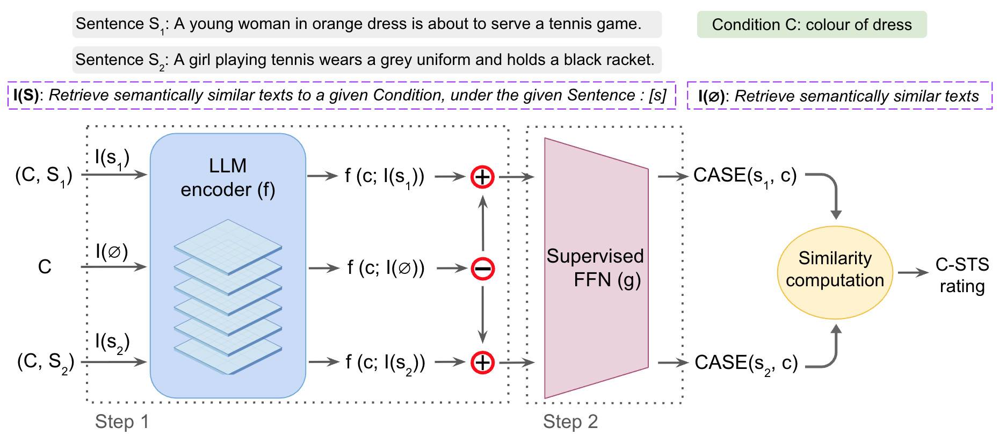

## CASE – Condition-Aware Sentence Embeddings for Conditional Semantic Textual Similarity Measurement [EACL2026]

<p align="center">
  
</p>

### Code Structure

| File | Description |
| :--- | :--- |
| `generate_embeddings.py` | **Step 1 of CASE**: Creates initial unsupervised condition-aware embeddings from the LLM encoders and saves them to disk. |
| `CASE_performance.py` | **Step 2 of CASE**: Trains the supervised FFN on the saved embeddings and evaluates performance on the C-STS benchmark. |
| `lora_finetune.py` | Fine-tunes the base LLM encoders on the C-STS task using LoRA. |
| `load_finetuned_llm.py` | Loads the saved LoRA adapters to generate conditional embeddings from the fine-tuned model. |
| `llm_encoders.py` | Helper class containing the `LLM_EMBEDDER` wrapper for various LLM architectures. |

### Data Preparison
We use the **C-STS-Reannotated** dataset. 
Please download the training and validation files (`csts_train_reannotated.csv` and `csts_validation_reannotated.csv`) from Hugging Face repository:
**[https://huggingface.co/datasets/LivNLP/C-STS-Reannotated](https://huggingface.co/datasets/LivNLP/C-STS-Reannotated)**

### Paper Link
For more technical details, please refer to our full paper:  
**[CASE -- Condition-Aware Sentence Embeddings for Conditional Semantic Textual Similarity Measurement](https://arxiv.org/abs/2503.17279)**

### Citation
If you find this work or the code useful, please cite our paper:

```bibtex
@misc{zhang2025caseconditionawaresentence,
      title={CASE -- Condition-Aware Sentence Embeddings for Conditional Semantic Textual Similarity Measurement}, 
      author={Gaifan Zhang and Yi Zhou and Danushka Bollegala},
      year={2025},
      eprint={2503.17279},
      archivePrefix={arXiv},
      primaryClass={cs.CL},
      url={https://arxiv.org/abs/2503.17279}, 
}
